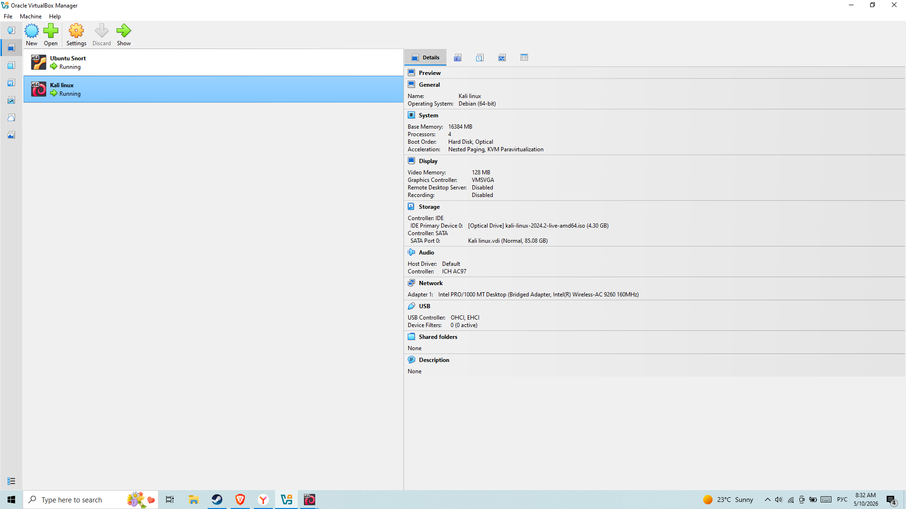
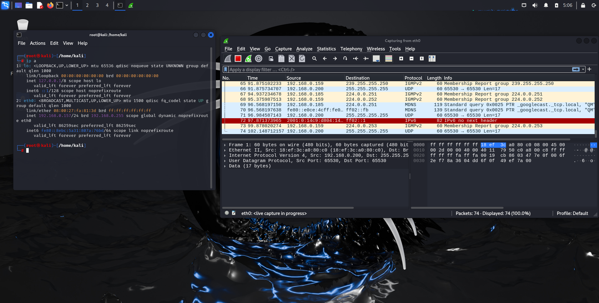
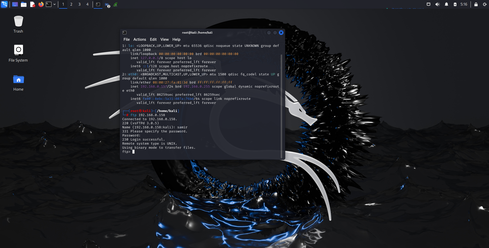
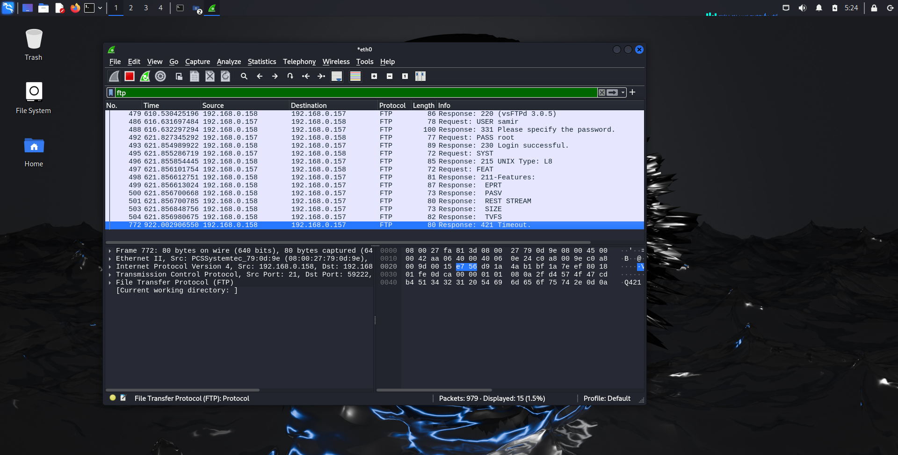
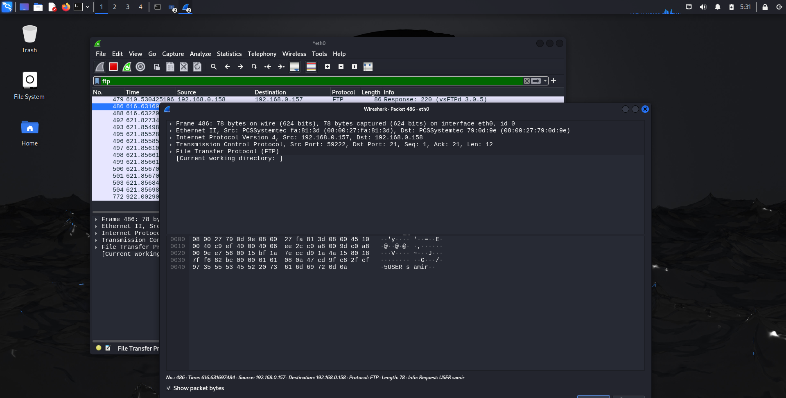

# FTP Traffic Analysis and Credential Exposure Using Wireshark

## Project Description

This project demonstrates basic network traffic analysis using Wireshark to inspect insecure FTP communication.

A virtual lab environment was built using VirtualBox with an Ubuntu Server acting as an FTP server and a Kali Linux machine used as the client. The FTP service was configured using vsftpd.

The Kali Linux machine connected to the FTP server, generating real network traffic. Wireshark was used to capture and filter FTP packets during the authentication process.

The analysis revealed that FTP transmits credentials (username and password) in plaintext, making them easily visible in network traffic captures.

This project demonstrates fundamental SOC and network analysis concepts, including packet inspection, traffic filtering, and identification of insecure protocols.

---

## Tools Used

- Wireshark
- Kali Linux
- Ubuntu Server
- vsftpd
- VirtualBox

---

## Lab Architecture and Analysis

### 1. VirtualBox Environment (Ubuntu Server + Kali Linux)

This screenshot shows the VirtualBox environment with both Ubuntu Server and Kali Linux running. The lab simulates network communication between a client and a server.

---

### 2. Wireshark Live Packet Capture

This screenshot shows Wireshark running on Kali Linux with live packet capture enabled on the selected network interface.

---

### 3. FTP Connection Established

This screenshot shows a successful FTP connection from Kali Linux to the Ubuntu Server, confirming an active session between client and server.

---

### 4. FTP Traffic Analysis (Plaintext Credentials)

This screenshot shows captured FTP traffic in Wireshark, revealing that credentials are transmitted in plaintext.

---

### 5. Packet-Level Analysis of FTP Authentication

This screenshot shows detailed packet inspection in Wireshark, highlighting the USER command and network-level information.

---

## Project Outcome

Successfully analyzed FTP network traffic using Wireshark and demonstrated that FTP is insecure due to plaintext credential transmission. The project highlights the importance of secure protocols and network traffic monitoring in cybersecurity.
